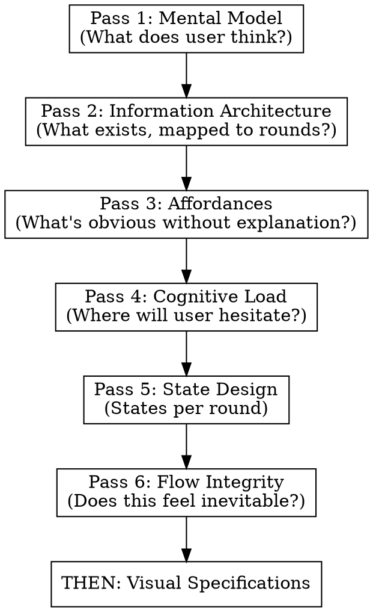

# PRD to UX Translation

**Workflow Position:** Step 2 of 3
**Input:** PRD document (from `prd-generator`)
**Output:** UX specification file (6 passes + visual specs)
**Next Step:** Use `ux-to-prompts` module to generate build-order prompts

---

**Foundational alignment:** UX specs must reinforce the pedagogy in `docs/PHILOSOPHY.md` (understanding precedes notation, earned reveal, visual confirmation) and the product alignment in `docs/PRODUCT.md`. Pass 1 (mental model) should explicitly align with "understanding precedes notation"; visual and interaction specs should support manipulation-first and visual confirmation, not multiple-choice or notation-first flows.

**Round-aware analysis:** The PRD now contains a Phase & Round Architecture (Section 5) with specific interaction rounds, each having an ID, description, and visual scaffolding spec. The 6 passes should reference these rounds directly. Pass 2 (IA) maps concepts to the round structure. Pass 5 (State Design) enumerates states per round. Visual specs reference the round-level visual scaffolding.

---

**Complete Planning Pipeline:**
```
MVP Idea → PRD (prd-generator) → UX Spec (this module) → Build Prompts (ux-to-prompts) → Implementation
```

## Overview

Translate product requirements into UX foundations through **6 forced designer mindset passes**. Each pass asks different questions that visual-first approaches skip.

**Core principle:** UX foundations come BEFORE visual specifications. Mental models, information architecture, and cognitive load analysis prevent "pretty but unusable" designs.

## When to Use

- Translating PRD for an interactive educational module into UX foundations
- Creating UX specifications from PRD requirements
- Before generating build-order prompts (see `ux-to-prompts`)
- Before any implementation work

**Context:** This is specifically for interactive learning modules using React Three Fiber and stage-based flows. The PRD's chosen stage flow and round structure take precedence — use whatever the PRD specifies.

## Output Location

**Write the UX specification to a file in the same directory as the source PRD.**

Naming convention:
- If PRD is `prd.md` → output `ux-spec.md`
- If PRD is `module-name-prd.md` → output `module-name-ux-spec.md`

**Do not output to conversation.** Always write to file so the spec is persistent and can be passed to the `ux-to-prompts` module for build-order generation.

## The Iron Law

```
NO VISUAL SPECS UNTIL ALL 6 PASSES COMPLETE
```

**Not negotiable:**
- Don't mention colors, typography, or spacing until Pass 6 is done
- Don't describe screen layouts until information architecture is explicit
- Don't design components until affordances are mapped

**No exceptions for urgency:**
- "I'm in a hurry" → Passes take 5 minutes; fixing bad UX takes days
- "Just give me screens" → Screens without foundations need rework
- "Skip the analysis" → Analysis IS the value; screens are just output
- "I know what I want" → Then passes will be fast; still do them

Skipping passes to "save time" produces specs that need redesign. The 6 passes ARE the shortcut.

## The 6 Passes

Execute these IN ORDER. Each pass produces required outputs before the next begins.

Before starting, read the PRD's Phase & Round Architecture (Section 5) thoroughly. You'll reference specific round IDs throughout the passes.



---

### Pass 1: User Intent & Mental Model Alignment

**Designer mindset:** "What does the user think is happening?"

**Force these questions:**
- What does the user believe this system does?
- What are they trying to accomplish in one sentence?
- What wrong mental models are likely (e.g. "notation first" or "pick the right answer")?
- How does this align with **understanding precedes notation** (`docs/PHILOSOPHY.md`) and the module's stage flow?
- What does the **core question** (from PRD Section 3.3) prime the student to expect?

**Required output:**
```markdown
## Pass 1: Mental Model

**Primary user intent:** [One sentence]

**Core question framing:** [How the module's core question shapes expectation]

**Likely misconceptions:**
- [Misconception 1]
- [Misconception 2]

**UX principle to reinforce/correct:** [Specific principle]
```

---

### Pass 2: Information Architecture

**Designer mindset:** "What exists, and how is it organized?"

This is where the round structure from the PRD becomes the organizing framework. Every concept the user encounters should map to a specific round or phase.

**Force these actions:**
1. Enumerate ALL concepts the user will encounter
2. Group into logical buckets
3. Classify each as: Primary / Secondary / Hidden (progressive)
4. **Map to round-level visibility** — for each concept, which round ID introduces it? Which rounds is it visible in? Where does it get hidden or replaced?

**Required output:**
```markdown
## Pass 2: Information Architecture

**All user-visible concepts:**
- [Concept 1]
- [Concept 2]
- ...

**Grouped structure:**

### [Group Name]
- [Concept]: [Primary/Secondary/Hidden]
- Introduced in round: [round-id]
- Visible through: [round-id range or "all rounds in phase N"]
- Rationale: [One sentence why this grouping]

### [Group Name]
...
```

**This is where most AI UX attempts fail.** If you skip explicit IA, your visual specs will be disorganized.

---

### Pass 3: Affordances & Action Clarity

**Designer mindset:** "What actions are obvious without explanation?"

**Force explicit decisions:**
- What is clickable?
- What looks editable?
- What looks like output (read-only)?
- What looks final vs in-progress?
- What changes between rounds? (Some affordances appear or disappear as rounds progress)

**Required output:**
```markdown
## Pass 3: Affordances

| Action | Visual/Interaction Signal | Rounds Active |
|--------|---------------------------|---------------|
| [Action] | [What makes it obvious] | [round-ids] |

**Affordance rules:**
- If user sees X, they should assume Y
- ...

**Round-dependent affordances:**
- [Affordance that appears only in certain rounds and why]
```

No visuals required—just clarity on what signals what.

---

### Pass 4: Cognitive Load & Decision Minimization

**Designer mindset:** "Where will the user hesitate?"

**Force identification of:**
- Moments of choice (decisions required)
- Moments of uncertainty (unclear what to do)
- Moments of waiting (system processing)
- **Round transitions** — where the student moves from one round to the next within a phase. Is the transition automatic, student-initiated, or gated by success?

**Then apply:**
- Collapse decisions (fewer choices)
- Delay complexity (progressive disclosure)
- Introduce defaults (reduce decision burden)

**Required output:**
```markdown
## Pass 4: Cognitive Load

**Friction points:**
| Moment | Round | Type | Simplification |
|--------|-------|------|----------------|
| [Where] | [round-id] | Choice/Uncertainty/Waiting | [How to reduce] |

**Round transitions:**
| From → To | Trigger | Student experience |
|-----------|---------|-------------------|
| [round-id] → [round-id] | [What causes the transition] | [What the student sees/feels] |

**Defaults introduced:**
- [Default 1]: [Rationale]
```

---

### Pass 5: State Design & Feedback

**Designer mindset:** "How does the system talk back?"

**Force enumeration of states for EACH round** — not just each screen or element. Each round is an interaction with its own state lifecycle.

For each round, answer:
- What is the **entry state** (what does the student see when this round begins)?
- What is the **active state** (what does the student manipulate)?
- What is the **prediction state** (has the student committed to a prediction)?
- What is the **reveal state** (what does the reveal show)?
- What is the **completion state** (what does the student see after succeeding)?

Not all rounds will have all states. Prediction/reveal rounds have the full set. Summary or pause rounds may only have entry and completion.

**Required output:**
```markdown
## Pass 5: State Design

### Phase [N]: [Title]

#### Round: [round-id] — [round-label]

| State | User Sees | User Understands | User Can Do |
|-------|-----------|------------------|-------------|
| Entry | | | |
| Active | | | |
| Prediction | | | |
| Reveal | | | |
| Completion | | | |

**Visual scaffolding notes:** [Reference the visual scaffolding from the PRD for this round]

#### Round: [round-id] — [round-label]
[... repeat for each round ...]
```

This prevents "dead UX"—rounds with no feedback or unclear state transitions.

---

### Pass 6: Flow Integrity Check

**Designer mindset:** "Does this feel inevitable?"

**Final sanity check:**
- Where could users get lost?
- Where would a first-time user fail?
- What must be visible vs can be implied?
- **Do the round transitions feel natural?** Is there a clear "why now?" for each round in the sequence?
- **Does the ALD progression hold?** Walk through the rounds in order and verify: does a student who succeeds at each round actually demonstrate the target ALD level by the end of the phase?

**Required output:**
```markdown
## Pass 6: Flow Integrity

**Flow risks:**
| Risk | Round(s) | Mitigation |
|------|----------|------------|
| [Risk] | [round-id(s)] | [Guardrail/Nudge] |

**Round sequence validation:**
- Phase [N] rounds in order: [round-ids] → ALD [level] demonstrated? [Yes/No + rationale]

**Visibility decisions:**
- Must be visible: [List]
- Can be implied: [List]

**UX constraints:** [Any hard rules for the visual phase]
```

---

## THEN: Visual Specifications

Only after all 6 passes are complete, create:
- Canvas/visualization layout (React Three Fiber scene structure)
- Component specifications (stage-based UI elements)
- Design system (lab color system, typography, spacing)
- Interaction specifications (slider controls, buttons, feedback elements)
- Responsive breakpoints (desktop side-by-side, mobile stacked)
- Stage machine configuration (what's visible when)
- **Per-round visual scaffolding specs** — expand the PRD's visual scaffolding notes into concrete visual descriptions using the affordances, states, and IA from the passes

**Module-specific considerations:**
- Align with `docs/PHILOSOPHY.md` and `docs/PRODUCT.md`: manipulation-first, earned reveal, visual confirmation (no multiple choice), LSSM rigor where applicable
- Reference existing module patterns in the codebase for product/technical framing
- Consider progressive reveal (unlock complexity gradually)
- Map to the module's stage flow (from PRD Section 5)
- Define discovery feedback patterns (badges, proximity indicators) that demonstrate competence through manipulation, not selection
- Reference the round IDs from the PRD when specifying per-round visuals

The 6 passes inform every visual decision.

## Red Flags - STOP and Restart

If you catch yourself doing any of these, STOP and return to the passes:

| Violation | What You're Skipping |
|-----------|---------------------|
| Describing colors/fonts | All foundational passes |
| "The main screen shows..." | Pass 1-2 (mental model, IA) |
| Designing components before actions mapped | Pass 3 (affordances) |
| No friction point analysis | Pass 4 (cognitive load) |
| States only in component specs, not per round | Pass 5 (holistic state design) |
| No "where could they fail?" | Pass 6 (flow integrity) |
| "User is in a hurry" | ALL passes — urgency is a trap |
| "Just this once, skip to visuals" | ALL passes — exceptions become habits |
| "The PRD is simple enough" | ALL passes — simple PRDs still need mental model analysis |
| Ignoring round structure from PRD | Pass 2, 4, 5 — rounds ARE the organizing unit |

## Common Mistakes

**Merging passes:** "I'll cover mental model while doing IA" → You won't. Separate passes force separate thinking.

**Skipping to visuals:** "The PRD is clear, I can design screens" → Baseline testing shows agents skip 4+ passes when allowed.

**Implicit affordances:** "Buttons are obviously clickable" → Map EVERY action explicitly. What's obvious to you isn't obvious to users.

**Scattered state design:** "I'll add states to each component" → Round-level state table in Pass 5 catches gaps.

**Ignoring round IDs:** "I'll reference phases generally" → Use specific round IDs. They become the integration points for build-order prompts.

## Output Template

```markdown
# UX Specification: [Module Name]

**Source PRD:** [path to PRD]
**Round count:** [N rounds across M phases]

## Pass 1: Mental Model
[Required content]

## Pass 2: Information Architecture
[Required content — mapped to rounds]

## Pass 3: Affordances
[Required content — with round-active columns]

## Pass 4: Cognitive Load
[Required content — with round transitions]

## Pass 5: State Design
[Required content — per round]

## Pass 6: Flow Integrity
[Required content — round sequence validation]

---

## Visual Specifications
[Only after passes complete — per-round visual scaffolding expanded]
```
